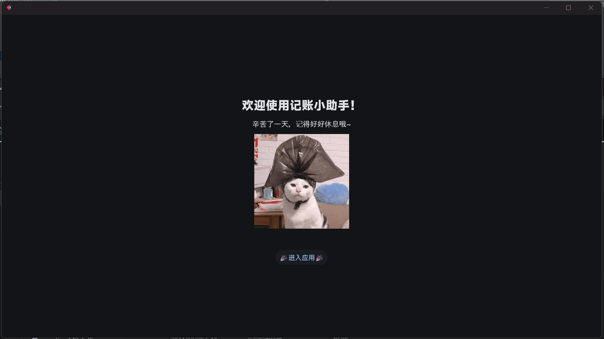

  

# 
米粒小助手

  
  

🎉一个基于Flet的计算小工具🎉

## 一、项目介绍

&emsp;&emsp;本工具使用Flet框架实现，用户可用于计算每天都赚了多少米，时间粒度可精确到小时（目前保留1位小数）。

### 1.1 设计初衷

&emsp;&emsp;家人们在日常生活中难免会需要用计算器计算最近几天赚了多少米粒，虽然市面上已经有计算米粒功能的计算器，但是没有以数据表格的形式生成。为了能够相对清楚地查看用户每日所赚的米粒数量，于是乎米粒小助手应运而生！

### 1.2 项目现状以及特性

&emsp;&emsp;目前本项目已经实现：

+ 简单易上手：控件数量少，没有多级菜单，小白也能快速掌握米粒小助手的使用
+ 数据增删清：通过三个按钮用户对每天的时米数进行统计，小助手自动计算用户每日赚取多少米粒
+ 动态数据表生成：用户输入数据的同时，小助手可以自动生成数据表，同时还可计算用户所有天数所赚取的米粒数量

## 二、使用教程

  

## 三、自编译与修改

&emsp;&emsp;如果不喜欢米粒小助手也不要紧，你可以clone本仓库并自己编译，注意需要先根据Flet文档安装Flet环境，然后运行“main.py”即可。关于如何编译，可以参考[Flet文档](https://flet.dev/docs/publish)。

&emsp;&emsp;米粒小助手的两个页面的控件内容分别是/pages目录下的两个文件。如果想修改页面内容，可以自行修改这两个文件。